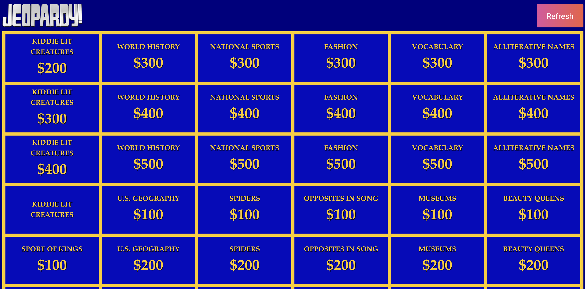

# Jeopardy Trivia Web App

This is a simple React web app that displays random Jeopardy trivia questions. The app is hosted on GitHub Pages.

## Usage

To use the app, simply visit the following link: [Jeopardy Trivia Web App](https://jamarcelin.github.io/jeopardy/)

## Repository Structure

- The distributable version of the application can be found on the `gh-pages` branch.
- The source code for the application can be found on the `master` branch.

## API

This web app utilizes the `jservice.io` API to fetch random Jeopardy trivia questions.

## Deployment

The deployment of this web app follows the guidelines outlined in the [react-gh-pages](https://github.com/gitname/react-gh-pages) repository.

Feel free to explore and enjoy playing Jeopardy trivia!

## Screenshots

